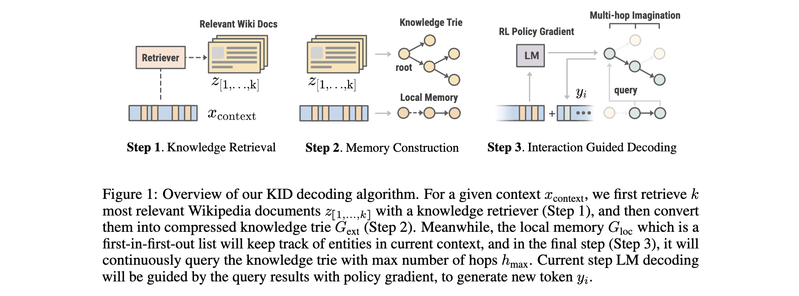

# Knowledge Infused Decoding

[Knowledge Infused Decoding (KID)](https://openreview.net/forum?id=upnDJ7itech) is a decoding algorithm that infuses knowledge (from Wikipedia) into each step decoding of text generation.



KID has been described in the following paper:

```bibtex
@inproceedings{liu2022knowledge,
    author = {Liu, Ruibo and Zheng, Guoqing and Gupta, Shashank and Gaonkar, Radhika and Gao, Chongyang and Vosoughi, Soroush and Shokouhi, Milad and Awadallah, Ahmed H.},
    title = {Knowledge Infused Decoding},
    booktitle = {International Conference on Learning Representations (ICLR)},
    year = {2022},
    month = {April},
    publisher = {ICLR},
    url = {https://www.microsoft.com/en-us/research/publication/knowledge-infused-decoding/},
}
```


## Getting Started

### Download Datasets

All the datasets used for the evaluation of KID can be downloaded in 
[this link](https://drive.google.com/drive/folders/1PDlZU7fkBQZV62UA8owEqKc142o-azmh?usp=sharing). The statistics of these datasets can be found in the Table A1 (Appendix) of the paper. 


### Download Knowledge Source

To construct the external knowledge trie for each task, we leverage the Wiki passages and corresponding [FAISS](https://github.com/facebookresearch/faiss) index used by [RAG](https://huggingface.co/docs/transformers/model_doc/rag). We prepare a script in `scrtips/build_trie.py` to 1) download passages and index, and 2) build the knowledge trie by query the context in the training data of a certain task. 

The complete loop of how local knowledge memory and external knowledge trie interact with each other is shown in Figure A1 (Appendix) of the paper.


### Use KID for Decoding

In the demo script (`scripts/run_demo.py`), we show how KID enables knowledge infusing even if the language model (GPT-2) is not fine-tuned. You can run with `python scripts/run_demo.py` with `is_kid=True`, and the output is:

```
# KID output
= The context for generation is: Does marijuana impair driving ability?
= KID Decoding: Does marijuana impair driving ability? The answer is yes and we do 
  believe it would be possible to impair the driving abilities of those who smoke 
  marijuana as it causes some people with medical condition to become unable to drive
  for an extended period of time.
```

While with vanilla sampling decoding (i.e., [Nucleus Sampling](https://arxiv.org/pdf/1904.09751.pdf)), the output is:

```
# Sampling output (is_kid=False)
= The context for generation is: Does marijuana impair driving ability?
= Sampling Decoding: Does marijuana impair driving ability? Professor, Jordan Allison
  and University of New South Wales researchers led by Alan Hayes and Phd in Public 
  Health investigate cannabis vs. alcohol impairment effects in adolescents
```

Apparently, the language model armed with KID can answer the question in a more informative and coherent way. Note that we can further improve the generation quality by replacing the vanilla GPT-2 with a task fine-tuned one, by setting the `model_path` in the head of `run_demo.py` with the path to your pre-trained language model.

## License
KID is MIT licensed. See the [LICENSE](./LICENSE.pdf) file for details.


